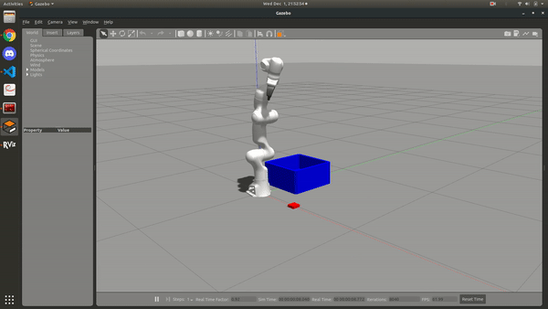

# Franka Panda - Pick and Place
Custom Franka Panda ROS packages for personal use



## How to run the simulation

Follow the installation instructions from [Erdals Blog](https://erdalpekel.de/?p=55 "Erdals Blog")

Run the following command after building and sourcing the workspace
```
roslaunch panda_simulation panda_simulation_effort.launch
```
## References

1. [Erdals Blog](https://erdalpekel.de/?p=55 "Erdals Blog")
2. [Grasp Plugin](https://github.com/JenniferBuehler/gazebo-pkgs "Grasp Plugin")
